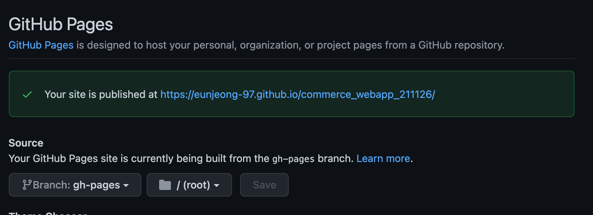

# Github Page Deploy

## 목차

- [1. Github Page URL](#1-github-page-url)
  - [1-1. Github Page URL생성](#1-1-github-page-url생성)
  - [1-2. package.json homepage 속성 추가](#1-2-packagejson-homepage-속성-추가)
- [2. gh-pages 환경(branch) 생성](#2-gh-pages-환경branch-생성)
- [3. package.json 배포명령어 추가](#3-packagejson-배포명령어-추가)
- [4. `.github/workflow/gh-pages.yml` 생성](#4-githubworkflowgh-pagesyml-생성)
- [5. index.html head영역에 내용추가](#5-indexhtml-head영역에-내용추가)
- [6. 참고자료](#6-참고자료)

## 1. Github Page URL

### 1-1. Github Page URL생성

- github repository 메뉴바의 왼쪽의 `settings` > `Pages` 탭으로 이동,
- `Source` 항목에서 일단 `main branch` 에서 배포하는 걸로 설정하고 `Save` 버튼
- Your site is published at `URL` 영역 확인



### 1-2. package.json homepage 속성 추가

- `package.json` 파일의 `name` 속성 위쪽에 `"homepage": {}` 입력

## 2. gh-pages 환경(branch) 생성

```
$ npm run build
$ npm install -g serve
$ npm install -D gh-pages
```

- github repository branch 에서 `gh-pages` branch 생성된거 확인
- `Source` 항목에서 `gh-pages` branch 로 배포한다고 수정
- 사이트에서 접속할 때 url의 path 맨 끝에 `index.html` 추가

```
https://eunjeong-97.github.io/commerce_webapp_211126/index.html
```

## 3. package.json 배포명령어 추가

- gh-pages 세팅
- `"deploy": "gh-pages -d build"`: React를 Build해서 생성되는 결과 폴더는 build라고 배포 명령어를 입력한다

```json
"scripts": {
    "build": "webpack --mode production",
    "predeploy": "npm run build",
    "deploy": "gh-pages -d build"
  },

"homepage": “url” // 제일 상단, github 배포

```

## 4. `.github/workflow/gh-pages.yml` 생성

- github action 추가
- `publish_dir: ./bulid`: 여기서 build 혹은 dist를 입력하면 되는데 package.json의 `"deploy": "gh-pages -d build"`에 맞춰서 적어주면 된다.

```yml
name: github pages

on:
  push:
    branches:
      - main

jobs:
  deploy:
    runs-on: ubuntu-18.04
    steps:
      - uses: actions/checkout@v2

      - name: Setup Node
        uses: actions/setup-node@v2.1.2
        with:
          node-version: '12.x'

      - name: Cache dependencies
        uses: actions/cache@v2
        with:
          path: ~/.npm
          key: ${{ runner.os }}-node-${{ hashFiles('**/package-lock.json') }}
          restore-keys: |
            ${{ runner.os }}-node-

      - run: npm ci
      - run: npm run build

      - name: Deploy
        uses: peaceiris/actions-gh-pages@v3
        with:
          github_token: ${{ secrets.GITHUB_TOKEN }}
          publish_dir: ./bulid
```

> [목차로 이동](#목차)

## 5. index.html head영역에 내용추가

```html
<head>
  <!-- Start Single Page Apps for GitHub Pages -->
  <script type="text/javascript">
    // Single Page Apps for GitHub Pages
    // https://github.com/rafrex/spa-github-pages
    // Copyright (c) 2016 Rafael Pedicini, licensed under the MIT License
    // ----------------------------------------------------------------------
    // This script checks to see if a redirect is present in the query string
    // and converts it back into the correct url and adds it to the
    // browser's history using window.history.replaceState(...),
    // which won't cause the browser to attempt to load the new url.
    // When the single page app is loaded further down in this file,
    // the correct url will be waiting in the browser's history for
    // the single page app to route accordingly.
    (function (l) {
      if (l.search) {
        var q = {};
        l.search
          .slice(1)
          .split('&')
          .forEach(function (v) {
            var a = v.split('=');
            q[a[0]] = a.slice(1).join('=').replace(/~and~/g, '&');
          });
        if (q.p !== undefined) {
          window.history.replaceState(
            null,
            null,
            l.pathname.slice(0, -1) +
              (q.p || '') +
              (q.q ? '?' + q.q : '') +
              l.hash
          );
        }
      }
    })(window.location);
  </script>
  <!-- End Single Page Apps for GitHub Pages -->
</head>
```

## 6. 참고자료

- [GitHub Pages에 React App(SPA) 호스팅 하기](https://iamsjy17.github.io/react/2018/11/04/githubpage-SPA.html)
