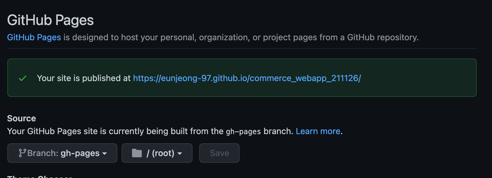

# React 프로젝트 초기세팅 및 Github page 배포하기

## 목차

1. [필요한 라이브러리 설치](#1-필요한-라이브러리-설치)
2. [React 초기세팅 진행](#2-필요한-라이브러리-설치)
3. [초기세팅 이외의 폴더 및 내용 파일추가](#3-초기세팅-이외의-폴더-및-내용-파일추가)
4. [React 프로젝트 실행](#4-react-프로젝트-실행)
5. [Github Repository 연결 및 업데이트](#5-github-repository-연결-및-업데이트)
6. [Github 배포 관련](#6-github-배포-관련)
7. [참고내용](#7-참고내용)

## 1. 필요한 라이브러리 설치

```
$ npx create-react-app 프로젝트명
$ cd 프로젝트명
$ npm install react-router-dom
$ npm install -D prettier eslint-config-prettier eslint-plugin-prettier
$ npm install styled-components
```

> [목차로 이동](#목차)

## 2. React 초기세팅 진행

### 2-1. App.js

```javascript
import React, { Component } from 'react';
import { BrowserRouter as Router, Routes, Route } from 'react-router-dom';

import ProductList from './pages/ProductList';
import ProductDetail from './pages/ProductDetail';
import Cart from './pages/Cart';

class App extends Component {
  render() {
    return (
      <Router>
        <Routes>
          <Route path="/" element={<ProductList />} />
          <Route path="/productDetail" element={<ProductDetail />} />
          <Route path="/cart" element={<Cart />} />
        </Routes>
      </Router>
    );
  }
}

export default App;
```

### 2-2. index.js

```javascript
import React from 'react';
import ReactDOM from 'react-dom';
import { ThemeProvider } from 'styled-components';

import GlobalStyles from './styles/GlobalStyles';
import App from './App';
import theme from './styles/theme';

ReactDOM.render(
  <>
    <GlobalStyles />
    <ThemeProvider theme={theme}>
      <App />
    </ThemeProvider>
  </>,
  document.getElementById('root')
);
```

### 2-3. src/styles/GlobalStyles.jsx

```jsx
import { createGlobalStyle } from 'styled-components';

const GlobalStyles = createGlobalStyle`
body,
div,
span,
h1,
h2,
h3,
h4,
h5,
h6,
p,
a,
abbr,
address,
em,
img,
q,
strong,
b,
i,
ol,
ul,
li,
form,
label,
article,
figure,
figcaption,
footer,
nav,
section,
main {
  margin: 0;
  padding: 0;
  border: 0;
  font-size: 100%;
  font: inherit;
}
ol,
ul,
li {
  list-style: none;
}
h1,
h2,
h3,
h4,
h5,
h6,
b,
strong,
i,
em {
  font-weight: normal;
  font-style: normal;
}
textarea {
  border: none;
  overflow: auto;
  outline: none;
  box-shadow: none;
  resize: none;
  cursor: text;
}
input,
button {
  border: none;
  outline: none;
  background: transparent;
}
a {
  text-decoration: none;
  color: inherit;
}
blockquote,
q {
  quotes: none;
}
blockquote:before,
blockquote:after,
q:before,
q:after {
  content: '';
  content: none;
}
table {
  border-collapse: collapse;
  border-spacing: 0;
}
*{
  box-sizing: border-box;
}
`;

export default GlobalStyles;
```

### ⚠️ node-scss로 진행할 때, `reset.scss` 설정할 땐

```scss
html,
body,
div,
span,
applet,
object,
iframe,
h1,
h2,
h3,
h4,
h5,
h6,
p,
blockquote,
pre,
a,
abbr,
acronym,
address,
big,
cite,
code,
del,
dfn,
em,
img,
ins,
kbd,
q,
s,
samp,
small,
strike,
strong,
sub,
sup,
tt,
var,
b,
u,
i,
center,
dl,
dt,
dd,
ol,
ul,
li,
fieldset,
form,
label,
legend,
table,
caption,
tbody,
tfoot,
thead,
tr,
th,
td,
article,
aside,
canvas,
details,
embed,
figure,
figcaption,
footer,
header,
hgroup,
menu,
nav,
output,
ruby,
section,
summary,
time,
mark,
audio,
video {
  margin: 0;
  padding: 0;
  border: 0;
  font-size: 100%;
  font: inherit;
  vertical-align: baseline;
}
/* HTML5 display-role reset for older browsers */
article,
aside,
details,
figcaption,
figure,
footer,
header,
hgroup,
menu,
nav,
section {
  display: block;
}
body {
  line-height: 1;
}
ol,
ul {
  list-style: none;
}
blockquote,
q {
  quotes: none;
}
blockquote:before,
blockquote:after,
q:before,
q:after {
  content: '';
  content: none;
}
table {
  border-collapse: collapse;
  border-spacing: 0;
}
```

### 2-4. src/styles/theme.jsx

```jsx
// 예시
const theme = {
  logoRed: 'rgb(233,0,22)',
  buttonGray: 'rgb(255,255,255)',
};

export default theme;
```

### ⚠️ node-scss 로 진행할 때 `common.scss` 설정하기

```scss
// 예시
@mixin flexCenter {
  display: flex;
  align-items: center;
  justify-content: center;
}

@mixin button {
  position: absolute;
  width: 50px;
  height: 50px;
  border: 1px solid black;
  opacity: 50%;
  top: 300px;
  transform: translateY(-50%);
  background-color: white;
  z-index: 1;
}

* {
  box-sizing: border-box;
  border: none;
  outline: none;
}
body {
  font-family: 'Noto Sans KR', sans-serif;
}

a {
  text-decoration: none;
  color: black;
}

button {
  background: transparent;
  border: none;
  outline: none;
  cursor: pointer;
}

input {
  outline: none;
}
```

> [목차로 이동](#목차)

## 3. 초기세팅 이외의 폴더 및 내용 파일추가

### 3-1. vscode/settings.json

- eslint & prettier 관련

```json
{
  "editor.defaultFormatter": "esbenp.prettier-vscode",
  "editor.tabSize": 2,
  "editor.formatOnSave": true,
  "editor.codeActionsOnSave": {
    "source.fixAll.eslint": true
  },
  "javascript.format.enable": false,
  "eslint.alwaysShowStatus": true,
  "files.autoSave": "onFocusChange"
}
```

### 3-2. `.eslintrc`

- eslint & prettier 관련

#### 모두 mac 유저

```json
{
  "extends": ["react-app", "plugin:prettier/recommended"],
  "rules": {
    "no-var": "warn", // var 금지
    "no-multiple-empty-lines": "warn", // 여러 줄 공백 금지
    "no-nested-ternary": "warn", // 중첩 삼항 연산자 금지
    "no-console": "warn", // console.log() 금지
    "eqeqeq": "warn", // 일치 연산자 사용 필수
    "dot-notation": "warn", // 가능하다면 dot notation 사용
    "no-unused-vars": "warn", // 사용하지 않는 변수 금지
    "react/destructuring-assignment": "warn", // state, prop 등에 구조분해 할당 적용
    "react/jsx-pascal-case": "warn", // 컴포넌트 이름은 PascalCase로
    "react/no-direct-mutation-state": "warn", // state 직접 수정 금지
    "react/jsx-no-useless-fragment": "warn", // 불필요한 fragment 금지
    "react/no-unused-state": "warn", // 사용되지 않는 state
    "react/jsx-key": "warn", // 반복문으로 생성하는 요소에 key 강제
    "react/self-closing-comp": "warn", // 셀프 클로징 태그 가능하면 적용
    "react/jsx-curly-brace-presence": "warn" // jsx 내 불필요한 중괄호 금지
  }
}
```

#### window 유저 포함

```json
{
  "extends": ["react-app", "plugin:prettier/recommended"],
  "rules": {
    "no-var": "warn", // var 금지
    "no-multiple-empty-lines": "warn", // 여러 줄 공백 금지
    "no-nested-ternary": "warn", // 중첩 삼항 연산자 금지
    "no-console": "warn", // console.log() 금지
    "eqeqeq": "warn", // 일치 연산자 사용 필수
    "dot-notation": "warn", // 가능하다면 dot notation 사용
    "no-unused-vars": "warn", // 사용하지 않는 변수 금지
    "react/destructuring-assignment": "warn", // state, prop 등에 구조분해 할당 적용
    "react/jsx-pascal-case": "warn", // 컴포넌트 이름은 PascalCase로
    "react/no-direct-mutation-state": "warn", // state 직접 수정 금지
    "react/jsx-no-useless-fragment": "warn", // 불필요한 fragment 금지
    "react/no-unused-state": "warn", // 사용되지 않는 state
    "react/jsx-key": "warn", // 반복문으로 생성하는 요소에 key 강제
    "react/self-closing-comp": "warn", // 셀프 클로징 태그 가능하면 적용
    "react/jsx-curly-brace-presence": "warn" // jsx 내 불필요한 중괄호 금지
    "prettier/prettier": [
      "error",
      {
        "endOfLine": "auto"
      }
    ]
  }
}
```

### 3-3. `.prettierrc`

- eslint & prettier 관련

```json
{
  "tabWidth": 2,
  "endOfLine": "lf",
  "arrowParens": "avoid",
  "singleQuote": true
}
```

> [목차로 이동](#목차)

## 4. React 프로젝트 실행

```
$ npm start
```

- 이 때 Error가 발생하면 Error 메시지에 따라 해결해주면 된다
- 문제없이 렌더링되는 거 확인하고 다음단계로 진행

> [목차로 이동](#목차)

## 5. Github Repository 연결 및 업데이트

```
$ git remote add origin {url}
$ git add .
$ git commit -m "커밋메시지"
$ git push origin main
```

> [목차로 이동](#목차)

## 6. Github Page 배포

### 6-1. Github Page URL

#### 생성

- github repository 메뉴바의 왼쪽의 `settings` > `Pages` 탭으로 이동,
- `Source` 항목에서 일단 `main branch` 에서 배포하는 걸로 설정하고 `Save` 버튼
- Your site is published at `URL` 영역 확인



#### package.json homepage 속성 추가

- `package.json` 파일의 `name` 속성 위쪽에 `"homepage": {}` 입력

### 6-2. gh-pages branch

```
$ npm run build
$ npm install -g serve
$ npm install -D gh-pages
```

- github repository branch 에서 `gh-pages` branch 생성된거 확인
- `Source` 항목에서 `gh-pages` branch 로 배포한다고 수정
- 사이트에서 접속할 때 url의 path 맨 끝에 `index.html` 추가

```
https://eunjeong-97.github.io/commerce_webapp_211126/index.html
```

### 6-3. package.json 배포명령어 추가

- gh-pages 세팅
- `"deploy": "gh-pages -d build"`: React를 Build해서 생성되는 결과 폴더는 build라고 배포 명령어를 입력한다

```json
"scripts": {
    "build": "webpack --mode production",
    "predeploy": "npm run build",
    "deploy": "gh-pages -d build"
  },

"homepage": “url” // 제일 상단, github 배포

```

### 6-4. `.github/workflow/gh-pages.yml` 생성

- github action 추가
- `publish_dir: ./bulid`: 여기서 build 혹은 dist를 입력하면 되는데 package.json의 `"deploy": "gh-pages -d build"`에 맞춰서 적어주면 된다.

```yml
name: github pages

on:
  push:
    branches:
      - main

jobs:
  deploy:
    runs-on: ubuntu-18.04
    steps:
      - uses: actions/checkout@v2

      - name: Setup Node
        uses: actions/setup-node@v2.1.2
        with:
          node-version: '12.x'

      - name: Cache dependencies
        uses: actions/cache@v2
        with:
          path: ~/.npm
          key: ${{ runner.os }}-node-${{ hashFiles('**/package-lock.json') }}
          restore-keys: |
            ${{ runner.os }}-node-

      - run: npm ci
      - run: npm run build

      - name: Deploy
        uses: peaceiris/actions-gh-pages@v3
        with:
          github_token: ${{ secrets.GITHUB_TOKEN }}
          publish_dir: ./bulid
```

> [목차로 이동](#목차)

## 7. 참고내용

- [Github Page 배포하기](https://velog.io/@byjihye/react-github-pages)
- [Github Page gh-pages 자동 업데이트](https://davidyang2149.dev/front-end/github-actions%EB%A5%BC-%EC%9D%B4%EC%9A%A9%ED%95%98%EC%97%AC-gh-pages-%EC%9E%90%EB%8F%99-%EB%B0%B0%ED%8F%AC%ED%95%98%EA%B8%B0/)
- [Github Page에 React APP(SPA) 호스팅 하기](https://iamsjy17.github.io/react/2018/11/04/githubpage-SPA.html)
- [React 프로젝트 초기세팅 설명](https://velog.io/@beanlove97/React-%ED%94%84%EB%A1%9C%EC%A0%9D%ED%8A%B8-%EC%B4%88%EA%B8%B0%EC%84%B8%ED%8C%85-%EB%B3%B5%EC%8A%B5#react-router-dom%EC%9D%B4-%EB%B2%84%EC%A0%84-6%EC%9C%BC%EB%A1%9C-%EC%97%85%EA%B7%B8%EB%A0%88%EC%9D%B4%EB%93%9C)
- [ESLint 및 Prettier 관련 내용](https://velog.io/@beanlove97/ESLint-Prettier)

> [목차로 이동](#목차)
